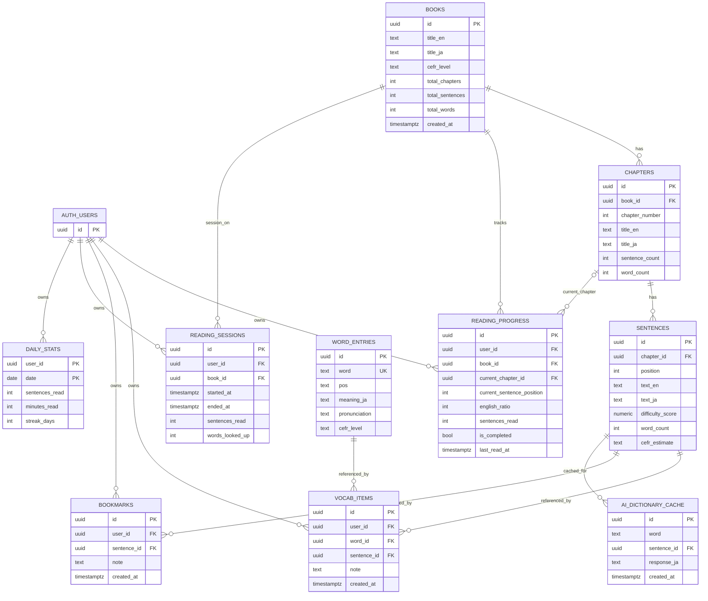

# Novelang データモデル・ER図
- 更新日: 2026-02-04
- 参照元: `supabase/migrations/001_initial_schema.sql`, `supabase/migrations/002_rls_policies.sql`

## 1. ER図

## 2. 主要制約
- `chapters`: `UNIQUE (book_id, chapter_number)`
- `sentences`: `UNIQUE (chapter_id, position)`
- `word_entries`: `word` 一意
- `reading_progress`: `UNIQUE (user_id, book_id)`
- `ai_dictionary_cache`: `UNIQUE (word, sentence_id)`
- `daily_stats`: `PRIMARY KEY (user_id, date)`

## 3. RLS要約
- 公開読取: `books`, `chapters`, `sentences`, `word_entries`, `ai_dictionary_cache`
- ユーザー所有: `reading_progress`, `vocab_items`, `bookmarks`, `reading_sessions`, `daily_stats`

## 4. レビュー観点
1. `daily_stats.user_id` は `auth.users` 参照を論理前提として扱っている
2. `reading_progress.current_chapter_id` は nullable（章未確定状態を許容）
3. キャッシュ粒度は `(word, sentence_id)` で、同単語でも文脈ごとに別レコード
