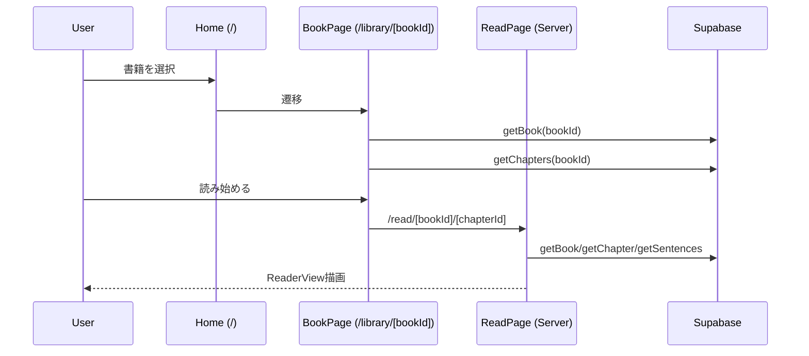
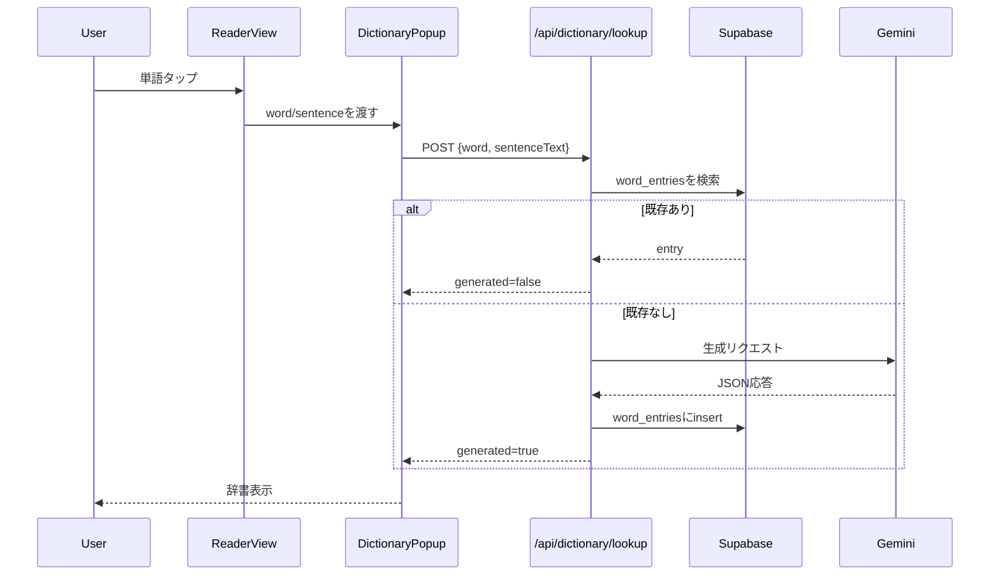
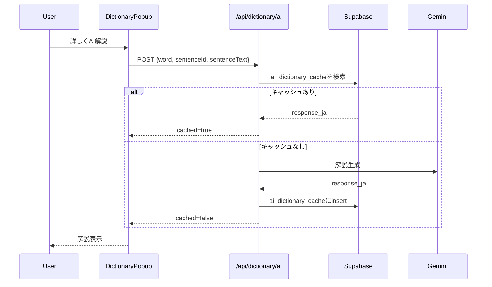

# Novelang 処理フロー
- 更新日: 2026-02-04

## 1. 読書開始フロー
1. `/` で書籍一覧を取得
2. `/library/[bookId]` で書籍詳細と章一覧を取得
3. `/read/[bookId]/[chapterId]` で `book/chapter/sentences` を取得
4. `ReaderView` を描画

## 2. 読書中の進捗保存
1. スクロール位置から現在文位置を算出
2. `saveProgress` を 2 秒 debounce で実行
3. `reading_progress` に upsert
4. 画面離脱時に `POST /api/stats/daily`

## 3. 通常辞書フロー
1. 単語タップで `DictionaryPopup` を開く
2. `POST /api/dictionary/lookup`
3. `word_entries` に既存があれば返却
4. 無ければ Gemini 生成結果を保存して返却

## 4. AI解説フロー
1. 「詳しくAI解説」押下
2. `POST /api/dictionary/ai`
3. `ai_dictionary_cache` にヒットすれば即返却
4. ヒットしなければ Gemini 生成しキャッシュして返却

## 5. 語彙保存と一覧表示
1. ポップアップで `vocab_items` に insert
2. `/vocab` で `vocab_items` を取得
3. `word_entries` と `sentences` を引いてクライアント側で結合表示
4. 削除時は `vocab_items` から delete

## 6. 日次統計と streak
1. `GET /api/stats/daily` で今日データと最新データを取得
2. 最新日が今日/昨日なら streak 継続、そうでなければ 0
3. `POST /api/stats/daily` で当日分を加算
